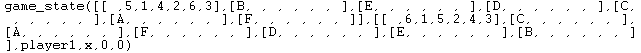
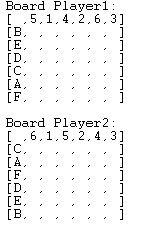
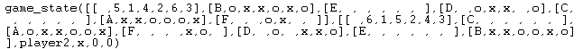
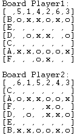
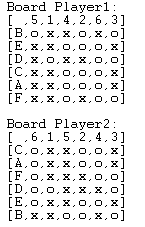

# PFL - Projeto2
## Identificação do tópico e grupo
**Jogo** : Doblin
**Group T11_Doblin_7:**
- Marta Silva: up202208258
- Tomás Vinhas: up202208437

  **Distribution of work**
- Marta Silva: Focou-se em implementar as funções "choose_move(+GameState, +Level, -Move)", "value(+GameState, +Player, -Value)", "game_over(+GameState, -Winner)", "valid_moves(+GameState, -ListOfMoves)".
- Tomás Vinhas: Focou-se na implemantação das restantes funções "display_game(+GameState)", "initial_state(+GameConfig, -GameState)", "game_over(+GameState, -Winner)", "move(+GameState, +Move, -NewGameState)".

- Embora cada um de nós tenha focado em funções específicas, trabalhámos juntos de forma próxima, ajudando-nos mutuamente e trocando ideias para superar os desafios que surgiram. Este trabalho em equipa ajudou-nos a melhorar cada parte do trabalho e a torná-lo mais eficiente. A divisão das tarefas foi equilibrada, e o esforço conjunto resultou num trabalho final bem integrado e otimizado.

## Instalação e Execução
Para instalar o jogo Doblin, comece fazendo o download e descompactando os arquivos do arquivo PFL_TP2_T05_Doblin_7.zip. Posteriormente, acesse o diretório src e abra o arquivo game.pl. Você pode fazer isso através da linha de comando ou utilizando a interface gráfica do Sicstus Prolog 4.7.1. O jogo está disponível tanto para Windows quanto para Linux. Para iniciar o jogo, execute o predicado play/0.

## Descrição do jogo:
O objetivo do jogo é ser o jogador com menos linhas e quadrados completos formados por quatro símbolos iguais. Para começar, cada jogador possui um tabuleiro 8x8, onde as linhas são identificadas por letras (A-H) e as colunas por números (1-8), dispostas numa ordem aleatória. 

O jogador 1 inicia o jogo. Em cada turno, o jogador escolhe duas casas vazias na sua grelha e coloca um "O" numa casa e um "X" noutra, anunciando as coordenadas escolhidas (por exemplo, "B3 e F5"). Todos os jogadores devem marcar os mesmos símbolos (O e X) nas mesmas coordenadas das suas grelhas. Depois, o turno passa para o próximo jogador. O jogo continua até que todas as grelhas estejam preenchidas. 

A pontuação é feita com base nas linhas ou quadrados completos formados por quatro símbolos iguais, sendo que cada combinação dá 1 ponto. Um mesmo símbolo pode contar para várias linhas e/ou quadrados ao mesmo tempo, acumulando mais pontos. No final do jogo, o jogador com menos pontos é declarado o vencedor.

- Mais informação em:
    -
    https://boardgamegeek.com/filepage/200477/doblin-rules-11
    https://boardgamegeek.com/boardgame/308153/doblin

## Considerações para extensões do jogo
A implementação de tabuleiros de jogo com tamanho variável. Permiu aumentar a flexibilidade do jogo, permitindo que os jogadores escolham o tamanho do tabuleiro de acordo com o tempo disponível para jogar ou com o nível de dificuldade desejado. Por exemplo, tabuleiros mais pequenos (6x6) são ideais para partidas rápidas ou para jogadores iniciantes, enquanto tabuleiros maiores (8x8) oferecem maior complexidade e são mais desafiantes, especialmente para jogadores experientes, onde ter uma boa estratégia é um fator fundamental para alcançar a vitória.

## Lógica do jogo

**Representação da configuração de jogo** : A configuração inicial do jogo Doblin contem o tamanho do tabuleiro, 6x6 ou 8x8, a dificuldade do jogador 1 e a dificuldade do jogador 2. Para tal, processou-se os respetivos inputs que indicavam o tamanho desejado do tabuleiro, bem como a dificuldade pretendida para cada um dos jogadores. De seguida colocaram-se estes três parâmetros na lista GameConfig que depois é usado pelo predicado initial_state/2 (initial_state(+GameConfig, -GameState)). Este predicado, através da configuração inicial de jogo, vai gerar dois tabuleiros vazios, com o tamanho desejado previamente. Este predicado vai devolver o GameState inicial, que irá conter os dois tabuleiros vazios, o primeiro jogador a começar a jogar (jogador 1), o símbolo correspondente a essa jogada (X) e a respetiva dificuldade dos jogadores. 

**Representação do estado interno do jogo** : 
O GameState é responsável por representar o estado atual do jogo, este contém o tabuleiro1, tabuleiro2, jogador, símbolo, dificuldade do jogador 1 e dificuldade do jogador 2. Ambos os tabuleiros são representados por uma lista de listas, de modo a representar uma matriz onde as jogadas podem ser colocadas. O jogador quem deve efetuar a próxima jogada e este é representado pelos átomos player1, player2. O símbolo indica a peça que o jogador a jogar deve colocar no tabuleiro, visto que em cada vez de jogada o jogador tem de colocar um X e um O, o símbolo é representado pelos átomos x e o. As respetivas dificuldades de cada jogador são representadas por 0 (jogador humano), 1 (computador na dificuldade random), 2 (computador na dificuldade gulosa). As seguintes imagens demonstram o GameState ao longo de uma partida:

- Inicial 

- Intermédio

- Final

**Representação do Movimento** : Para representar um movimento do jogo, é necessário ter informações sobre os dois tabuleiros, o movimento a executar, o jogador atual e o símbolo que será jogado. As coordenadas de um movimento são representadas por uma lista [Letter, Number], onde “Letter” identifica a linha do tabuleiro e “Number” a coluna. Essas coordenadas são convertidas em índices correspondentes nos dois tabuleiros, que possuem letras e números embaralhados. Essa conversão é realizada pela função coordinates_to_indices/4 que utiliza nth0/3 para localizar a posição da letra e do número em listas auxiliares derivadas de cada um dos tabuleiros, determinando assim o índice real do movimento correspondente em cada tabuleiro. Posteriormente, o predicado update_board/5 modifica a célula correspondente nos dois tabuleiros com o símbolo do jogador atual.
Assim, a função “move” recebe o estado atual do jogo, que inclui informações sobre os dois tabuleiros, o jogador atual e o símbolo que será jogado, além do movimento a ser executado. Ela retorna um novo estado do jogo após a execução do movimento.
Para isso, a função realiza a conversão das coordenadas, traduzindo-as em índices para localizar a célula correspondente nos tabuleiros. Em seguida, as células correspondentes nos dois tabuleiros são atualizadas com o símbolo do jogador atual. Por fim, o estado do jogo é atualizado, alterando o símbolo e o jogador para o próximo turno. O novo estado do jogo é então retornado na variável NewGameState.

**Interação com o usuário**:  O sistema de menu do jogo permite que o usuário escolha entre diferentes modos de jogo (Human/Human, Human/PC, PC/Human, PC/PC) e defina o tamanho do tabuleiro. Se o modo de jogo envolver o PC, é também solicitada a escolha do nível de dificuldade ("random" ou "greedy"). As opções são apresentadas com números correspondentes, e o jogador deve selecionar o número desejado. A interação é cuidadosamente controlada, garantindo entradas válidas através da função get_valid_option/2, que verifica se o número inserido está dentro das opções válidas. Caso a entrada seja inválida (como múltiplos caracteres ou um número fora do intervalo), o sistema limpa o buffer e solicita novamente.
Além disso, a função read_input/2 lê as coordenadas do movimento do jogador, validando-as. A função get_valid_letter/4 garante que a letra da coordenada (linha) esteja dentro do intervalo válido, de acordo com o tamanho do tabuleiro, enquanto a função get_valid_option/2 valida o número (coluna). Após as coordenadas serem validadas, elas são convertidas em índices, e a função empty_cell verifica se a célula no tabuleiro está vazia antes de realizar a jogada.

## Conclusões:
O programa atingiu seus principais objetivos, implementando um jogo funcional com modos de jogo variados, tamanhos de tabuleiro configuráveis e níveis de dificuldade. No entanto, apresenta limitações que podem ser aprimoradas. As estratégias do computador, limitadas a "random" e "greedy", oferecem pouco desafio para jogadores experientes. Além disso, a interface baseada em texto, simples e em preto e branco, carece de apelo visual e intuitividade.
Desenvolver uma interface gráfica (GUI) melhoraria a experiência do usuário, permitindo representar o tabuleiro com elementos visuais e cores, além de fornecer feedback claro para ações do jogo. Também seria importante implementar estratégias de IA mais avançadas, como para oferecer um jogo mais estratégico e desafiador, com vários níveis de dificuldade eu vão de encontro ao perfil de cada jogador. Essas melhorias tornariam o jogo mais moderno, atrativo e acessível.

## Bibliografia
Utilizamos os recursos e exemplos presentes no moodle para o desenvolvimento do nosso projeto. Para além disso, recorremos também à ferramenta AI Chatgpt para correção de algumas funcionalidades que não estavam totalmente corretas, tal como a função calculate_points que por vezes dava resultados incorretos e com a ajuda do Chatgpt conseguimos perceber o problema e corrigí-lo.
